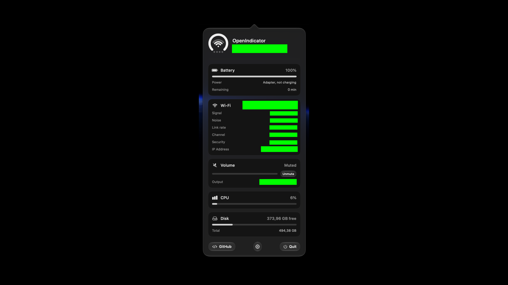

# OpenIndicator

A macOS menu bar app showing battery, Wi-Fi, and volume as one glyph (💍) — a ring for battery, arcs for signal, dots for volume.

## Running it

1. Open `OpenIndicator.xcodeproj` in Xcode.
2. Press ⌘R.
3. Click the glyph for the panel, right-click for Settings/Quit.

First launch prompts for Location access — only used to read the Wi-Fi network name and signal strength via CoreWLAN.

Values worth reusing elsewhere — like the IP address — can be clicked to copy them straight to the clipboard.

## Project structure

| File | What it does |
|---|---|
| `OpenIndicatorApp.swift` | Entry point. No windows — lives in the menu bar only. |
| `AppDelegate.swift` | The `NSStatusItem` and `NSPopover` that hold everything together. |
| `RingIcon.swift` | The glyph — battery ring, Wi-Fi arcs, volume dots, one view reused at every size. |
| `RingMenuBarLabel.swift` | Feeds live data into `RingIcon` for the menu bar. |
| `RingPanelView.swift` | The popover: header, metric cards, footer. |
| `SettingsView.swift` | Settings, embedded as a second screen in the same popover. |
| `GlassStyle.swift` | Liquid Glass helpers and Reduce Transparency support. |
| `SystemMonitor.swift` | Reads battery (IOKit), Wi-Fi (CoreWLAN + `NWPathMonitor`), volume (CoreAudio), CPU (Mach `host_statistics`), and disk (`URLResourceValues`). |
| `AppSettings.swift` | Persisted preferences, including launch-at-login via `SMAppService`. |

## Disclaimer

No pre-compiled .dmg is provided, meaning this project must be built manually via Xcode. This software is provided exactly as-is without any warranties. If compiling or running this code causes system damage, data loss, or any other issues, absolutely no responsibility is accepted, and all risks are entirely assumed by the user.

## License

GPL-3.0